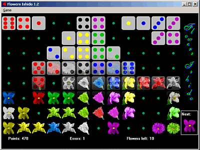

# Flowers Ishido

**New!** Scroll down an play Ishido online in this page. It is an experimental HTML5 version that requires a modern browser to work properly. I will release it under an open source license soon. Please note that scores are not shared: they are saved locally by your browser.  
  
A [mobile version](../../../mobile/ishido/) is available too.

Flowers Ishido is a little game I wrote many years ago for Windows 3.1; fortunately it continues to run on more recent versions of Windows (excluding 64 bit versions &mdash; see comments for details), so I'm happy to make it available for download.

[ Download Flowers Ishido](flowish.exe)

This game is distributed as freeware and is a porting of a game available for Unix platforms.

These are the rules of the game, as included with the X version.

> There are 72 tiles, two of each combination of six colors and six shapes. At the start of the game, there are six tiles on the board representing each shape and color. To place an additional tile on the board, you must match at least one adjacent tile according to the following rules:
> 
> 
> 
> - > 
To match a single tile, you must match either the color or shape.

>

> - > 
To match two tiles, you must match one shape and one color.

>

> - > 
To match three tiles, you must match two colors and one shape OR two shapes and one color.

>

> - > 
To match four tiles, you must match two colors and two shapes.

>

> 

> You cannot make more than 10 errors!
> 
> 
> This is the scoring:
> 
> 
> 
> - > 
Matching one tile: 1 point.

>

> - > 
Matching two tiles: 2 points.

>

> - > 
Matching three tiles: 4 points.

>

> - > 
Matching four tiles: 8 points. In addition to the regular score there is an increasing bonus for each four-way match starting with 25 points for the first and continuing with 50, 100, 200, 400, 600, 800, 1000, 5000, 10000, and 50000 points.

>

> 

> A bonus of 1000 points is awarded at the end of the game placing for all 72 tiles. 500 and 100 points are awarded for one and two tiles remaining.