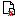

# MeshCMS 3.6 User Guide

# 

**Abstract**

MeshCMS is a simple content management system written in Java. This guide illustrates the most common operations that MeshCMS users will need to learn, from installation to daily usage.

---

[1. Introduction](#introduction)[2. Installation](#install)[1. Basic Procedures](#install_basic)[2. Choosing a Charset](#charsets)[3. Upgrade](#upgrade)[3. Basic Concepts](#basic_concepts)[1. The Site Map](#site_map)[2. External Documents and Tools](#external_tools)[3. Serving multiple sites from a single installation](#multiple_sites)[3.1. Main site and virtual sites](#main_and_virtual_sites)[4. Common Tasks](#common_tasks)[1. Create a Theme](#create_theme)[1.1. The Theme Main File](#theme_main_file)[2. Edit a Page](#edit_page)[3. Create a New Page](#create_new_page)[5. Control Panel](#control_panel)[1. Page Manager](#page_manager)[2. Configure](#configure)[3. Edit Profile](#edit_profile)[4. New User](#new_user)[5. File Manager](#file_manager)[5.1. Upload](#upload)[5.2. Unzip](#unzip)[6. Site Synchronization](#site_synchronization)[7. Static Export](#static_export)[8. Site Manager](#site_manager)[6. Modules](#modules)[1. Standard Modules](#standard_modules)[1.1. Audio Player](#module_audio_player)[1.2. Blog](#module_blog)[1.3. Blog Calendar](#module_blog_calendar)[1.4. Blog Tag List](#module_blog_tag_list)[1.5. Chat](#module_chat)[1.6. Comments](#module_comments)[1.7. Diary](#module_diary)[1.8. Downloads](#module_downloads)[1.9. Embed](#module_embed)[1.10. Frame](#module_frame)[1.11. Gallery](#module_gallery)[1.12. Headlines](#module_headlines)[1.13. Include](#module_include)[1.14. Include As Text](#module_include_as_text)[1.15. Latest Changes](#module_latest_changes)[1.16. List Pages](#module_list_pages)[1.17. Mail](#module_mail)[1.18. Most Visited](#module_most_visited)[1.19. Parse](#module_parse)[1.20. Site Map](#module_site_map)[1.21. Video Player](#module_video_player)[7. Tag Library](#tag_library)[1. Mandatory Tags](#tags_mandatory)[1.1. editor](#tag_editor)[1.2. pagehead](#tag_pagehead)[1.3. pagebody](#tag_pagebody)[2. Page Design Tags](#tags_page_design)[2.1. setlocale](#tag_setlocale)[2.2. defaultcss](#tag_defaultcss)[2.3. contextpath](#tag_contextpath)[2.4. themepath](#tag_themepath)[2.5. adminpath](#tag_adminpath)[2.6. searchfile](#tag_searchfile)[3. Page Elements Tags](#tags_page_elements)[3.1. pagetitle](#tag_pagetitle)[3.2. module](#tag_module)[3.3. moduletitle](#tag_moduletitle)[3.4. adminmenu](#tag_adminmenu)[3.5. mailform](#tag_mailform)[3.6. feed](#tag_feed)[4. Navigation Tags](#tags_navigation)[4.1. listmenu](#tag_listmenu)[4.2. alibmenu](#tag_alibmenu)[4.3. simplemenu](#tag_simplemenu)[4.4. tigramenu](#tag_tigramenu)[4.5. breadcrumbs](#tag_breadcrumbs)[4.6. links](#tag_links)[4.7. langmenu](#tag_langmenu)[5. Information Tags](#tags_information)[5.1. info](#tag_info)[5.2. user](#tag_user)[5.3. lastmodified](#tag_lastmodified)[6. Conditional Tags](#tags_conditional)[6.1. iflang](#tag_iflang)[6.2. ifuser, ifnotuser](#tag_ifuser)[6.3. ifediting, ifnotediting](#tag_ifediting)[6.4. ifmodule, ifnotmodule](#tag_ifmodule)[6.5. ifmailform, ifnotmailform](#tag_ifmailform)[6.6. ifindexed, ifnotindexed](#tag_ifindexed)[6.7. ifadminpage, ifnotadminpage](#tag_ifadminpage)[8. Tips](#d0e3559)[1. TinyMCE configuration](#tinymce_config)[2. Multilingual sites](#multilingual)[3. Publish a Sitemap](#d0e3664)

## Chapter 1. Introduction

MeshCMS is an online editing system written in Java. It provides a set of features usually included in a CMS, but it uses a more traditional approach: pages are stored in regular HTML files and all additional features are file-based.

MeshCMS is available under the [GPL license](http://www.gnu.org/copyleft/gpl.html). It allows some different usage approaches:

- it can be used as a simple, basic CMS. The user interface allows to edit pages visually, add and delete pages and do other basic tasks. This kind of approach should be easy enough for everyone;
- more experienced users can create complex themes and modules to fulfill specific needs. MeshCMS offers many convenience classes and methods, and it allows to create JSP pages that will be added to the site map just like plain HTML pages;
- since MeshCMS uses plain files and supports the standard SiteMesh configuration, many external Java applications can be integrated quite easily.

Main features are:

- **file-based** - no database needed;
- **easy to install** - deploy meshcms.war and you're done (tested on Tomcat and Jetty);
- **multi-site support** - multiple sites can be served with a single installation on a single context;
- **compatible with other editors** - since it is file-based, you can edit your files with other programs if you want, then upload them as usual;
- **search engine friendly** - due to its file-based nature, sites made with MeshCMS get pretty URLs by default, have a clear site map and are easily indexed by search engines;
- **wysiwyg editor included** - uses [TinyMCE](http://tinymce.moxiecode.com/);
- **file manager** with image thumbnails, file operations, clipboard, upload, download, unzip and other functions - can also be used from within the wysiwyg editor to select links and images;
- support for **themes** - uses [SiteMesh](http://www.opensymphony.com/sitemesh/) as engine;
- support for **modules** to create commonly used components automatically - some module templates are provided (image gallery, mail form, download list, site map and others);
- **tag library** to create new themes easily - menus and other common components are created automatically.

## Chapter 2. Installation

## 1. Basic Procedures

If you want to try MeshCMS, the simplest way to get started is to copy meshcms.war or samples.war into the webapps directory of your application server (e.g. [Tomcat](http://jakarta.apache.org/tomcat/) or [Jetty](http://jetty.mortbay.org/)) and open _http://localhost:8080/meshcms/_ or _http://localhost:8080/samples/_.

If you want to deploy a website, you will have to configure a virtual host for it as usual. There is nothing special in the setup of MeshCMS, so please refer to the documentation of your application server to choose the configuration options that best suit your needs.

MeshCMS is able to create thumbnails of images, so you need to provide an environment that allows image processing. On some systems you might need to add the -Djava.awt.headless=true option to the Java VM that runs the Servlet container.

Starting from version 3.0, MeshCMS allows to serve multiple sites from within a single context. If you want to do this, you should configure the context to accept all domains that you want to host. Here's a simple example of server.xml file for Tomcat 5.5 that accepts all domain names:

<Server port="8005" shutdown="SHUTDOWN">
  <Service name="Catalina">
    <Connector port="8080" />

    <Engine name="Catalina" defaultHost="localhost">
      <Host name="localhost" appBase="/usr/local/tomcat/webapps">
        <Context path="" docBase="ROOT" />
      </Host>
    </Engine>
  </Service>
</Server>
### Note

ROOT is the recommended name for the root context in a Tomcat host.

## 2. Choosing a Charset

MeshCMS is file-based, so it needs to pick up a charset to read and write files. Files are written by MeshCMS itself, but they are read by the servlet container (e.g. Tomcat) and processed by SiteMesh. For this reason, MeshCMS will use the system charset to ensure compatibility. If the charset encoding of the platform is not good for you, you can override it using the -Dfile.encoding=`charsetname` option in the command that launches the Java VM to run the servlet container.

MeshCMS is developed on UTF-8 and ISO-8859-1 machines, but many users have different charsets and use them successfully.

A complete charset like UTF-8 is always preferable, even if you plan to use English characters only: the default charset is used extensively across all the CMS, even for mail messages sent through mail forms. If someone sends you a message in another language, it would be unreadable since the browser will translate all unknown characters to HTML entities.

## 3. Upgrade

Starting from version 3.0, MeshCMS is composed of two directories: /meshcms/admin and /WEB-INF. To perform an upgrade, you should delete the current versions of those directories and use the new ones. Be careful not to delete the whole /meshcms directory, but just the admin subdirectory.

This upgrade strategy works fine in case of a simple usage of MeshCMS. In other cases the upgrade process can be harder. You probably won't modify the contents of the /meshcms/admin directory, but the /WEB-INF one is more likely to be changed. If you want to add an external application, or if you want to configure SiteMesh differently, you must keep track of your changes so that you can integrate them with the new release.

## Chapter 3. Basic Concepts

## 1. The Site Map

The site map is one of the most important MeshCMS components. Since MeshCMS is file based, there is no site map defined in a database, so MeshCMS must figure it out by parsing the file system. The site map is not a simple list of pages: it is a hierarchical structure which follows some strict rules.

The key of the site map is the concept of welcome file. This concept is well known by webmasters. When you access http://www.site.com/somedirectory/somepage.html, the file somepage.html located in the /somedir directory is sent to your browser. But when you access http://www.site.com/somedirectory/, you are requesting a directory, not a file. In such case, a file with a specific name is searched into that directory and, if it is available, that file is sent to your browser. Usually this file is called index.html, but more than one can be specified, and the first match will be used. The default for MeshCMS is to search for index.html, then index.htm and finally index.jsp (you can change this by editing the web.xml configuration file according to the Servlet specification). The result of this convention is that accessing http://www.site.com/somedirectory/ and accessing http://www.site.com/somedirectory/index.html will lead to the same page.

MeshCMS uses the welcome files heavily. When it encounters a directory while parsing the website tree, it checks whether that directory contains a welcome file or not. If there is no welcome file, **that directory is ignored**, along with all subdirectories. This means that all pages included in that directory will _not_ be included in the site map, and that users will not find those pages in the navigation menu.

### Note

Pages included in ignored directories are still available by using a direct link or by typing the full address in the browser location bar.

Why is the site map made this way? There are two main reasons. The first one is that if a directory without welcome file were included in the navigation menu, clicking on it would show a listing of the directory contents, or an error page if that listing is not allowed. So this is a way to force the use of a welcome page. The second reason is that there are many cases where a page must not be available in the navigation menu. Suppose that you want to use the [include module template](#modules) to add some news in your web pages. You will create a directory that will contain an HTML file for each news, and then you will use that directory as module argument. If none of the HTML files has the name of a welcome file, those news will not be inserted in the navigation menu directly, but they will still available for the module as expected. This is just an example of a situation in which a welcome file should not be used.

When a directory contains a welcome file, it is inserted in the site map, and all other items available in that directory are included as children pages. Items can be files (HTML or server-side pages) or directories (which must have their own welcome file as explained above).

This method has an important drawback: **a page that is not a welcome file cannot have children pages**. For example, there is no way to add a child page to http://www.site.com/somedirectory/somepage.html. This is usually not a problem, since you can always create a page at the same level (for example http://www.site.com/somedirectory/otherpage.html), but if you think you will want to add children pages to a page, use a new directory for it. Keep in mind that http://www.site.com/somedirectory/somepage.html and http://www.site.com/somedirectory/somepage/index.html are indexed **exactly in the same way**. If you create new pages using the [Page Manager](#page_manager) tool, leave the "Create enclosing directory" box checked, so you will be able to add children pages to your new page in future.

## 2. External Documents and Tools

One of the reasons that led to the creation of MeshCMS was the need to manage hundreds of HTML documents created previously, and to be able to add some Microsoft Word documents if needed. As a consequence, MehsCMS accepts any HTML file that it finds while exploring the website directory to create the site map. Thanks to the power of SiteMesh, pages created in different ways are parsed and decorated, while the title can be extracted to be used in the site menu.

Some MeshCMS users constantly upload Word documents converted to HTML, while others edit pages directly on the web using external tools like Macromedia Contribute, which they can find more comfortable than using the online editor provided by MeshCMS.

This approach has led to some choices that are different from the ones made for other CMSes. For example, there's no need to specify in which order pages must be inserted in the navigation menu. While one can prefer to take full control of that order, this is really tedious when dealing with hundreds of documents. MeshCMS automatically puts the welcome file at the beginning on the list and then orders the other pages according to the number of visits in the last days. This brings the most requested documents at the beginning of the list.

The [Page Manager](#page_manager) tool offers an option to assign a score to each page anyway. Pages with higher score will always come first, regardless of the count of visits. It is a tedious process to use scores to order the whole site map, and it is not a user-friendly method at all. But partial orderings are allowed: default score is zero for all pages, so one can assign a score just to those pages that he wants to see at the beginning (positive score) or at the end (negative score) of the list. Pages with the same score are ordered according to the number of visits.

Most users assign a score to first-level pages (for example: home page, company profile, products and finally contacts), while subpages are left without score.

Another consequence of the need to support documents that come from many sources is that MeshCMS does not check them for standard compliance. It respects the generalistic approach that is allowed by SiteMesh. Of course, a web developer is still allowed to put document type definitions in his own themes and to require his users to deal with well-formed documents only.

## 3. Serving multiple sites from a single installation

Tomcat and other servlet containers allow to create multiple hosts, and to put multiple contexts within them. Web developers usually need to host more than a single website on the same server, so they end up creating a host for each website and specifying which domains must be served by that host. This is a good setup strategy since it allows to separate sites and to tune their configuration. Nevertheless, this method leads to many installations of MeshCMS that must be maintained separately, which is quite annoying, for example when upgrading.

MeshCMS 3 gives the choice between this approach and a different one: you can install it once and serve all sites from that single context. You will probably configure the host to serve all domains and let MeshCMS map them to different sites. The advantages of this approach are:

- you have to deal with a single installation of the software;
- you will save some server resources;
- you can see the files of all sites from the file manager if you have the needed permissions;
- you can configure the sites and their mappings using the web interface.

The drawbacks are:

- it is more difficult to manage security separately for each site;
- if you use JSP pages in virtual sites, you must keep into account the fact that MeshCMS will map URLs to files differently.

To serve multiple sites, you need to install MeshCMS as usual. Then you can use the [Control Panel](#control_panel) to create new sites. If the DNS has been configured properly, you can access new sites immediately. Please do so, log into it with your admin user of the main website and check the [site configuration](#configure) to make sure that all options are fine. You may also want to create some users, a welcome page and so on.

### 3.1. Main site and virtual sites

When you install MeshCMS, you have a single site. This is the good old default scenario. You can add a virtually unlimited number of virtual sites on top of it. While virtual sites behave like the main one apparently, there are some differences between. The main difference is the fact that a different file is served when a page of a virtual site is requested. Normally, if you configure a Tomcat host to serve www.site1.com and www.site2.com, the same file will be served for http://www.site1.com/index.html and http://www.site2.com/index.html. That file is simply /index.html, located in the root context. But if you setup www.site2.com as a virtual site on top of www.site1.com, a request for http://www.site2.com/index.html will lead to /meshcms/sites/site2.com/index.html.

## Chapter 4. Common Tasks

## 1. Create a Theme

One of the essential features of a CMS is the ability to apply a common look & feel to many pages, adding the graphics and some other components like the navigation menu. In MeshCMS you can achieve this result by using a theme. There is a special directory in MeshCMS whose default path is /meshcms/themes. A theme is a subdirectory of /meshcms/themes that contains all the elements needed by the theme itself. Those elements are:

- the theme main file: a JSP page named main.jsp that defines the common part of the pages and where the variable parts must be inserted;
- the theme CSS: a CSS file named main.css that has the only special feature of being automatically linked from the page if the [defaultcss](#tag_defaultcss) custom tag is used. This should always be done, since using that syntax, the CSS will also be sent to the wysiwyg editor to display the page body being edited;
- an additional CSS for MeshCMS specific styles (page editor and modules), named meshcms.css. If this CSS is not found in the theme, the default one will be used. You can override it if you want to change the appearance of MeshCMS components (the default is located in the /meshcms/admin/theme directory);
- any other file needed by the theme: other CSS files, images, javascripts and so on. You can then use these files in your main file by inserting the [themepath](#tag_themepath) tag that will be replaced with the right path to the theme directory.

You can assign a theme to a page using the [Page Manager](#page_manager) tool in the Control Panel. There's no need to assign a theme to each page: if a page has no theme, the theme of the parent will be used. For example, if www.yoursite.com/apage.html has no theme, it will look like www.yoursite.com. In many cases a theme is assigned to the home page and that's all.

### 1.1. The Theme Main File

The main file of a theme is a JSP file that will include component of the page being shown:

<%@ taglib uri="meshcms-taglib" prefix="mesh" %>

<html>
 <head>
  <title><mesh:pagetitle /></title>
  <mesh:defaultcss />
  <mesh:pagehead />
 </head>

 <body>
  <mesh:editor>
   <mesh:pagebody />
  </mesh:editor>
 </body>
</html>This theme file is very basic, but it works: when applied to the sample MeshCMS home page, it looks this way:

The same basic theme can be used to edit the page:

Now you know that a basic theme isn't complicated at all. In fact, it is a normal HTML page (which you can create with your favorite editor), that includes some [custom tags](#tag_library) that will be replaced by MeshCMS with the contents of the page. This is how MeshCMS translates the page above:

<html>
 <head>
  <title>Home Page</title>
  <link type="text/css" rel="stylesheet" href="/meshcms/themes/bare/main.css" />
  <link type="text/css" rel="stylesheet" href="/meshcms/admin/theme/meshcms.css" />
  <meta http-equiv="Content-Type" content="text/html; charset=utf-8">
 </head>

 <body>
  
Welcome to MeshCMS 2.0. Here is a list ...

  ...
 </body>
</html>When you create a theme, you should create a normal HTML page along with its own CSS file and images and store all files in a directory. Use some text placeholder to point out where to put page components. For example, write [TITLE] where you expect to see the title of the page, [SITE MENU] where you want to see the menu, [BODY] where the text of the page should be located and so on. Please note that the notation with square brackets has nothing special. They are just placeholders. You might also use the "lorem ipsum" text instead of [BODY]. Your file might look like this one:

This is the corresponding HTML code:

<html>

<head>
  <title>[TITLE]</title>
</head>

<body style="margin: 0px;">
<table width="770" border="0" cellspacing="0" cellpadding="0">
  <tr>
    <td colspan="2" valign="bottom" style="background: url(flowers.jpg) no-repeat; ¶
     height: 120px; padding: 10px; font-size: 22px;">[TITLE]</td>
  </tr>
  <tr>
    <td bgcolor="#E2E0C9">
    <table border="0" align="center" cellpadding="3" cellspacing="0">
      <tr><th>Site Menu:</th></tr>
      <tr><td>[SITE MENU]</td></tr>
      <tr><th>MeshCMS Menu:</th></tr>
      <tr><td>[MESHCMS MENU]</td></tr>
    </table>
    </td>
    <td><table border="0" cellspacing="0" cellpadding="5">
      <tr><td>[BREADCRUMBS]</td></tr>
      <tr><td>[BODY]</td></tr>
    </table></td>
  </tr>
  <tr align="center">
    <td colspan="2" bgcolor="#DDBC00">
      Powered by <a href="http://www.cromoteca.com/meshcms/">MeshCMS</a>
    </td>
  </tr>
</table>
</body>

</html>When you are happy with your page, open it with a source code editor. Replace:

- [TITLE] with <mesh:pagetitle />
- [SITE MENU] with <mesh:simplemenu />
- [MESHCMS MENU] with <mesh:adminmenu />
- [BREADCRUMBS] with <mesh:breadcrumbs />
- [BODY] with <mesh:pagebody />

There is a link to an image in the file: you must add <mesh:themepath /> before the image path so it will be found correctly. url(flowers.jpg) becomes url(<mesh:themepath />/flowers.jpg).

Then add this line at the beginning of your file:

<%@ taglib uri="meshcms-taglib" prefix="mesh" %>Save your file and name it main.jsp. The CSS must be named main.css and must be located in the same directory. This directory must be located in the /meshcms/themes directory in your site, and the name of the directory will be used as name of the theme itself. All images and other files must be located in the same directory. You can use subdirectories, but then you need to write paths accordingly: for example, if you put all images in a subdirectory called images, you will use url(<mesh:themepath />/images/flowers.jpg) in the example above.

When your brand new decorator is available, reopen the home page of your web site and your new look & feel should now be used to display the page:

**<%@ taglib uri="meshcms-taglib" prefix="mesh" %>**

<html>

<head>
  <title>**<mesh:pagetitle />**</title>
</head>

<body style="margin: 0px;">
<table width="770" border="0" cellspacing="0" cellpadding="0">
  <tr>
    <td colspan="2" valign="bottom" style="background: ¶
     url(**<mesh:themepath />**/flowers.jpg) no-repeat; height: 120px; ¶
     padding: 10px; font-size: 22px;">**<mesh:pagetitle />**</td>
  </tr>
  <tr>
    <td bgcolor="#E2E0C9">
    <table border="0" align="center"cellpadding="3" cellspacing="0">
      <tr><th>Site Menu:</th></tr>
      <tr><td>**<mesh:simplemenu />**</td></tr>
      <tr><th>MeshCMS Menu:</th></tr>
      <tr><td>**<mesh:adminmenu separator=" " />**</td></tr>
    </table>
    </td>
    <td><table border="0" cellspacing="0" cellpadding="5">
      <tr><td>**<mesh:breadcrumbs />**</td></tr>
      <tr><td>**<mesh:pagebody />**</td></tr>
    </table></td>
  </tr>
  <tr align="center">
    <td colspan="2" bgcolor="#DDBC00">
      Powered by <a href="http://www.cromoteca.com/meshcms/">MeshCMS</a>
    </td>
  </tr>
</table>
</body>

</html>There are other tags that you must add in your decorator:

- <mesh:pagehead /> and <mesh:defaultcss /> go inside the <head> tag of your file to include headers and CSS;
- <mesh:editor>...</mesh:editor> must enclose all the contents of the <body> tag;
- <mesh:setlocale /> to define the locale of the pages that will use the theme (optional);
- you will probably want to add one or more [modules](#modules); otherwise you can't take advantage of available modules in your pages;
- other [tags](#tag_library) could be useful in some cases.

After these other modifications, you should get this source code:

<%@ taglib uri="meshcms-taglib" prefix="mesh" %>
**<mesh:setlocale value="en" />**

<html>

<head>
  <title>
    <mesh:pagetitle />
    **<mesh:pagehead />**
    **<mesh:defaultcss />**
  </title>
</head>

<body style="margin: 0px;">**<mesh:editor>**
<table width="770" border="0" cellspacing="0" cellpadding="0">
  <tr>
    <td colspan="2" valign="bottom" style="background: ¶
     url(<mesh:themepath />/flowers.jpg) no-repeat; height: 120px; ¶
     padding: 10px; font-size: 22px;"><mesh:pagetitle /></td>
  </tr>
  <tr>
    <td bgcolor="#E2E0C9">
    <table border="0" align="center" cellpadding="3" cellspacing="0">
      <tr><th>Site Menu:</th></tr>
      <tr><td><mesh:simplemenu /></td></tr>
      <tr><th>MeshCMS Menu:</th></tr>
      <tr><td><mesh:adminmenu separator=" " /></td></tr>
    </table>
    </td>
    <td><table border="0" cellspacing="0" cellpadding="5">
      <tr><td><mesh:breadcrumbs /></td></tr>
      <tr><td><mesh:pagebody /></td></tr>
    </table></td>
  </tr>
  <tr align="center">
    <td colspan="2" bgcolor="#DDBC00">
      Powered by <a href="http://www.cromoteca.com/meshcms/">MeshCMS</a>
    </td>
  </tr>
</table>
**</mesh:editor>**</body>

</html>

## 2. Edit a Page

Once you have logged in, you should see some links to edit a page while viewing it. Select "Edit this page" and the wysiwyg editor ([TinyMCE](http://tinymce.moxiecode.com/)) will show up, along with other fields to edit the page title and the various modules.

Editing a page shouldn't be that hard. TinyMCE provides a standard interface to write text and format it as desired. It comes with its own help.

MeshCMS adds the ability to browse for links and images. Just click on the  Browse icon in the image and link popups to access the file manager with all its functions (upload included). The link popup also contains a drop down list with all pages available in the site map to insert links in a moment.

### Note

in some cases, when saving a page you might want to unckeck the "use relative URLs when saving" option, so local links will be saved with the full path. This is useful when saving pages to be included with the include [module](#modules): this option will allow links included in that pages to work regardless of the page in which they will be included.

### Note

TinyMCE comes pre-configured in MeshCMS, but you can change that configuration, for example to use other features and plugins.

Other than editing the main page text, MeshCMS supports modules to automate some common page components. See [Section 1, &#8220;Standard Modules&#8221;](#standard_modules) for details.

## 3. Create a New Page

In MeshCMS a page is a file. Period. Having said that, there are three ways to add a new page:

1. open the [File Manager](#file_manager) and create a new HTML file in the desired place. Please keep in mind how the [site map](#site_map) is created;
2. (much easier) go to the [Control Panel](#control_panel), then choose [Page Manager](#page_manager). Choose the  icon associated to the right page: you will add a child page to that one. A small popup will open. Insert a title for the page (use a short one since it wiil be used to create a name for the file: you will be able to change it while editing the page). Uncheck Create enclosing directory only if you are absolutely sure that you won't add a child page to the new one in future. Then click on Create and the editor will be opened;
3. (the easiest way) navigate to a page and click on New page or on New child page. You will add a new page at the same level of the current one or a child page respectively. Then continue as above (insert the title and so on).

Additionally, you can add (and edit) pages from outside MeshCMS, for example using an FTP client. After doing that, make sure you run Refresh Site Map in the Control Panel so MeshCMS can find your new page(s). The site map is automatically refreshed after some hours, so new pages will be found even if you don't start the update manually.

## Chapter 5. Control Panel

This is the home page of the MeshCMS admin area. It contains icons for the all availabe tools. Icons are shown or hidden according to user's privileges.

Some of them are very simple: there is a link to the home page, a button to log in or out and a button to refresh the site map. This one is useful when something has been changed from outside MeshCMS (e.g. via FTP or some shell), when you want to empty the cache for some reason, or when you want menus to be re-ordered according to current page hits.

Other functions are more complex and are described in separate sections.

## 1. Page Manager

Here the site map is shown in a convenient way and some actions are available for each page. The table has these columns:

- **Page title**: shows the title of the page, preceded by an icon that allows to show/hide children pages (if any).
- **Hits**: a count of the page hits in the last days. This is not serious statistics, but since this count is stored to be used when sorting pages, it is shown here to have a rough idea of how much a page is being visited.
- **Cache**: indicates if the page is currently available in the page cache.
- **Menu Caption**: the name of the page in the navigation menus, breadcrumbs and links. If the field is empty, the page title will be used instead.
- **Theme**: the theme used for the page. If the field is empty, the theme of the parent will be used. If no theme is selected, the page will be shown "as is".
- **Score**: a number that indicates the &#8220;importance&#8221; of the page. This value is used to sort pages in menus. Pages with the same score are sorted according to their hits. If the score is not specified, its value is zero, so you can use a negative value to put pages at the end of the list.
- **Actions**: icons to perform some actions related to that page:

_View this page_;
- _Edit this page_: uses the best editor (visual or source) according to the file type;
- _Create a new child page_: available if that page can have children (see [Section 1, &#8220;The Site Map&#8221;](#site_map) for details);
- _Delete this page_: available if the page has not children pages;
- _Toggle submenu visibility_: if grayed out, some menus will take this option into account and will not display children of that page (useful when a page has too many children for example).

## 2. Configure

The configure page is available to administrators only. Editable options are divided in groups.

The first section allows to define some values for the site, which can be useful or not according to the theme used. The theme can display them using the [info](#tag_info) tag.

- **Name**: name of the site;
- **Host (domain)**: the main host for the site (e.g. www.site.com, not the full URL);
- **Description**: a description of the site (usually inserted into the related meta tag);
- **Keywords**: some keywords for the site (usually inserted into the related meta tag);
- **Author**: name of the site author (e.g. for a copyright notice);
- **Author full URL**: full address of the author's website.

The second section defines some interface parameters.

- **Visually editable types**: a comma-separated list of file types that can be edited using the wysiwyg editor;
- **Use system theme**: if this option is selected, the default system theme will be used for the control panel and for all other administrative pages. While it is preferable to use the same theme as the rest of the site, it is recommended to turn this option on while editing themes, so admin pages are always available without errors;
- **Prevent hotlinking**: if selected, others are not allowed to link to your images and files directly: they must link to pages on your site. A simple window will be shown to state that the file comes from your site. That page won't mention that you're using MeshCMS;
- **Use high quality thumbnails by default**: if selected, the file manager and the gallery module will create thumbnails with a better quality;
- **Resize images on the server when needed**: if selected, when an image with a defined size is found in the page HTML code, MeshCMS will replace it with a resized image, so you can safely include a big image in a page and resize it from within TinyMCE. Note that it is recommended to enable high quality thumbnails (see above) when this option is on;
- **Modules are collapsed initially in the editor**: if this option is checked, you will need to click on a module caption in the editor to modify the module. This has been done to make the editor interface less cluttered when a theme has many modules.

The third section configures the SMTP server used to send mail messages.

- **Server name**: the name of the server used to send e-mail messages when a visitor compiles a mail form;
- **Username**: needed if the server requires authentication;
- **Password**: needed if the server requires authentication.

The fourth section defines more system parameters.

- **Page cache**: used to activate the page caching. This is highly recommended since the "decoration" of a page is a quite expensive task. If you have much memory (or few pages), you can store cached pages in memory, otherwise save them on disk. By default, a mixed strategy is used: memory storage with fallback to disk. Pages are saved in GZIP format and are sent compressed when the browser supports that (always true with modern browsers);
- **Clean HTML code when saving**: used to improve quality of generated HTML: if this option is enabled, pages edited visually are post-processed on the server to generate valid XHTML;
- **Site map update interval (hours)**: the validity of the site map. After the specified amount of hours, the site map is recreated and the page cache is emptied;
- **Backup life (days)**: the validity of backup files. Those files are stored in the repository. While there is no interface to manage them at the moment, they are still available in the file system so a deleted file can be recovered in case of mistake using an FTP client or some other shell;
- **Hits counting period (days)**: page hits are counted for some days to allow to sort pages when no other criteria is available. If you change this value, the new one will be used after a restart of the web application;
- **Length of page excerpt (characters)**: length of the part of page that is stored in the site map for fast retrieving (used in the RSS feed and in some modules);
- **Always redirect to welcome pages**: check this option to ask MeshCMS to check if a welcome file is available when the required URL points to a directory. Usually the servlet container does this, but it is not the case for the default Jetty configuration for example. Setting this option to true allows to achieve a uniform behavior and offers better safety if virtual sites are used (the servlet container is not aware of MeshCMS virtual sites);
- **Redirect moved pages if possible**: if this option is enabled, MeshCMS tries to redirect not found pages to other ones based on file path. Similar paths are matched starting from the end and going up recursively: a page like www.site.com/products/someproductline/productname will be successfully redirected to www.site.com/somedivision/products/someproductline/productname;
- **Always deny directory listings**: check this option to show an error when a directory is required and there's no welcome file within it. Again, you can achieve the same result by configuring the servlet container properly, but if virtual sites are used it is better to make use of this option instead of relying on the container;
- **Hide Java exceptions when possible**: if this option is checked, MeshCMS tries to catch Java exception and hide its details to site visitors (it will be logged though);
- **Redirect the home page to one of the available languages**: if this option is checked and there is at least a page whose path is equal to a language code (e.g. /en, /it), requests for the home page will be redirected to the language that matches browser preferences (see [Section 2, &#8220;Multilingual sites&#8221;](#multilingual));
- **Disable public access to this website**: if this option is checked, you will need to login to see any page of this website.

## 3. Edit Profile

The purpose of this page is simple: you can change your password and edit your profile. Details are optional. The e-mail is optional too, but is located between the required elements since there's the plan to add a simple message board in future.

## 4. New User

To create a new user, you need to specify these info:

- **username**;
- **user type**: Administrator has all privileges, Editor can edit pages but can't do admin stuff and Member can browse files and not much more (in fact it is rarely used);
- **home directory**: the directory in which the user can edit files;
- **password**: an initial password that can be changed later by the user himself.

All other fields are optional.

## 5. File Manager

The MeshCMS file manager is a web-based version of the file manager you probably use daily on your computer. It allows to manage the file system of your website.

The look & feel of the file manager window should be familiar to everyone. On the left there is the directory tree, while the contents of the currently opened directory are shown on the right. There you can select some items and choose an action from the menu at the top of the window.

Most of the menu items are easy to understand. Probably the Themes menu is the most &#8220;obscure&#8221;, in fact it is rarely used. This menu allows to specify what theme should be applied to a page or directory. Normally it's easier to apply themes using the [Page Manager](#page_manager) feature of the Control Panel, but using the file manager you can apply themes even to files not included in the site map. Simply select the desired items and then pick a theme for them. If you choose Don't Specify, the theme will be inherited from the parent directory (this is the default for all items that don't have an associated theme, in fact if you only select a theme for the home page, all other pages will use it). If you choose No Theme, nothing will be applied to that file, which will be shown "as is".

### Note

Since the file manager is a web application, operations are not executed immediately. Commands are sent to the server the usual request-execution-response cycle must happen. While much care has been taken to ensure that command are interpreted correctly, please try to execute one task at a time, making sure you wait it to complete before doing another thing.

### 5.1. Upload

The upload tool is essential, since it is used to add new files. You can upload one file at a time, so if you need to upload many files, you better create a ZIP archive, upload it and finally [unzip](#unzip) it.

To upload a file, navigate to the desired directory and select Upload from the Tools menu. Then select the file from your computer and start uploading.

### Important

a file with the same name will be overwritten without confirmation.

### 5.2. Unzip

You can unpack a ZIP archive from within the file manager. It will be unpacked in the same directory or in a subdirectory, so make sure to put it in the right place before unzipping (you can always move the unpacked items later).

Select the ZIP file (it can have any extension) and choose Unzip from the Tools menu. You'll see a list of the files that are packed into the archive. If you prefer, you can check the flag to unzip the files in a new directory and edit its name. Note that many archives already put all files in a directory: you can verify if this is the case by looking at the list of files.

### Important

this operation is quite dangerous, since it will overwrite files if needed, without backing them up. So it is highly recommended to unzip files in a new directory as described above. Then you can move them safely.

## 6. Site Synchronization

This command allows to copy a site over another one. At the end of the operation, the two websites will be identical, with the exception of generated content (e.g. user comments).

To take advantage of this feature, you are supposed to create two sites, say cms.yoursite.com and www.yoursite.com. You use the former to make all changes you need (create/edit/delete pages, upload files, move stuff and so on), then you will copy it over the latter when you want to publish all changes on the live site. If you want to keep your changes secret, you can password protect the first site (see [Section 2, &#8220;Configure&#8221;](#configure)).

### Note

this approach is completely optional: you can keep using a single site and change it directly.

In the interface you can choose the destination site and include or exclude site map information and site configuration from the copy operation. Site map information contains all data that is edited using the [Page Manager](#page_manager), so it is recommended to include it, while site configuration is generally kept out. Additionally, you need to provide valid user credentials for the target site.

### Important

if you make some changes on the target site, they will be lost when you copy over it, so please remember to use one site for editing and the other for live use.

## 7. Static Export

MeshCMS offers an option to export a static copy of the site. That copy can be served by any HTTP server (e.g. Apache) without the need of a Java Servlet container. For example, you could use static export to edit a site in the Intranet using a local Tomcat, then publishing the site on an external server at any time.

Please note that the lack of a servlet container means that modules that require server interaction (like [Mail](#module_mail) and [Comments](#module_comments)) won't work as expected. All others will work since their content (e.g. gallery thumbnails) will be generated while exporting.

To perform a static export, some parameters must be specified:

- **URL to get the home page**: needs to be explicitly set when the local URL is different from the external one. For example, suppose that your Tomcat is running on a machine named _localserver_, and that its firewall redirects connections to port 80 to Tomcat, which is running on port 8080. In such a situation, you will access Tomcat externally at http://localserver/, while the static export (which accesses pages from the server itself) must use http://localserver:8080/, or http://localhost:8080/. In this case, the local URL must be specified;
- **Destination directory**: the local path of the exported copy, i.e. where the site will be exported (required);
- **Check for files that do not need to be updated**: if checked, files already exported are not copied again. This works for files whose modification time is newer in the target directory. Please note that pages are always re-exported, since changes could be in generated parts, like menus or modules;
- **Command to be executed after export**: an optional command that can be run when the export is completed. This is a shell command to be executed in a process and could be used to sync the exported site on a FTP connection. As a trivial example, you could use sh -c 'ls -R /my/exporting/dir' or cmd /c "dir /s C:\my\exporting\dir" to get a list of exported files.

## 8. Site Manager

The site manager is available for administrators only. It is not available at all in virtual sites. It is used to manage virtual sites and to map domains to sites. If no virtual sites are defined, this page can be used to define the first one. Otherwise, more options are available.

- **Use directory names as domain names**: if true, names of the directories that contain virtual sites will be taken into account when mapping domains to sites;
- **Automatically manage the "www." prefix**: if true, an additional mapping will be used for each domain name specified, to map the same domain with the www prefix added. This parameter applies to _all_ domain names defined;
- **Domain aliases for the main website**: a comma-separated list of domain names that must point to the main website. If no domain names are specified, all domain names that are not mapped to other sites will point to the main site. If at least a domain is specified and an unlisted domain is requested, MeshCMS will send a server error as response;
- **CMS enabled**: a flag that indicates that the CMS is active in that website (otherwise it is just a static website);
- **Block JSPs**: allows to limit the usage of JSP pages in that site for security reasons. It relies on a code filter that should allow harmless operations only Currently, it allows to:

use the MeshCMS taglib with the cms prefix;
- use the page JSP directive;
- use JSP comments;
- use HTML (tags, doctypes and comments).

### Note

This block may result in a strong limit for the website, since themes can only use the taglib and legal custom modules are nearly useless.

After these options, a table of virtual sites follows. For each site the directory name is shown and a check indicates that the CMS is active for that site. It is possible to add or modify a comma-separated list of domains that will be mapped to that site.

At the end of the list, a blank row is available to create a new site. You must specify the directory name and optionally add aliases and enable the CMS.

Please be careful when specifying domain names: if a domain is mapped to more than one site, it is hard to know which one will be associated to that domain.

## Chapter 6. Modules

## 1. Standard Modules

A web page is not just a block of text. Many pages on the web perform some common tasks: image galleries, mail forms, news and so on. While one can just write down those pages each time, it is clear that some automation is possible in those cases. The MeshCMS answer to this demand is the concept of module. A module is a configurable zone in a page: when you edit the page, you have some boxes where you can select a module and provide an argument (usually a file or directory) and some advanced parameters. If the argument is not specified, modules behave differently: some can default to the directory that contains the page, while others will do nothing.

### Note

the argument of a module is not necessarily a directory or a file. For example, in the mail module you can specify an e-mail address as argument, and a standard form will be created using that address as recipient.

When you edit a page, you will have the chance to configure as many modules as the page theme specifies. Normally all themes should contain a module at least. For each module you can also set a title and some advanced parameters. The former can be displayed in the page or not, according to the theme used. The latters depend on the module used and allow to customize it further, although modules are expected to provide an adequate default behavior when no parameters are specified.

MeshCMS provides some modules, and others can be created by everyone that is able to write a JSP page. Details about available modules are illustrated in the following sections.

### 1.1. Audio Player

The audio player module shows a MP3 player using the Flash-based [XSPF Web Music Player](http://musicplayer.sourceforge.net/). It will play all the MP3 files that are available in the directory passed as argument.

Argument: path to a file or directory. If not provided, defaults to the directory that contains the current page.

### 1.2. Blog

The blog module shows a preview of pages in a directory using a blog-like interface: content is truncated to a maximum length and links to full pages are provided. Pages are ordered by date and meta keywords are displayed as "article tags".

Starting from version 3.5, this module is highly configurable and can replace other modules like Most Visited and

Argument: path to a file or directory. If not provided, defaults to the directory that contains the current page.

Advanced parameters:

- `css`: the name of a css class;
- `date`: the type of file date to be shown. Possible values are none (default), normal (date only) and full (date and time);
- `sort`: the preferred sorting order. Accepted values are newest (default, newest articles first) and mostviewed (most viewed articles first);
- `mode`: the text rendering, can be html (default) or text;
- `entries`: number of entries per page (default 5);
- `maxchars`: maximum length of the excerpt for each article (default as per site configuration);
- `history`: shows a link to previous articles, true (default) or false;
- `keywords`: shows keywords (tags) after each article, true (default) or false;
- `readlink`: shows a link to the full article after the excerpt, true (default) or false;
- `updatedate`: updates page last modified time, true (default) or false. Note that this does not change the last modified time on disk, unless explicitly required by the [lastmodified tag](#tag_lastmodified);
- `imagesize`: size in pixels of article images (images that are in the same folder have a name in the required format, i.e. index_image.jpg for index.html or page_image.jpg for page.html); if this parameter is not specified, images are not shown even if available;
- `tag`: if specified, only pages with that tag will be shown in the blog.

### 1.3. Blog Calendar

The blog calendar module shows a list of months/years to select articles in a specific month. It has been thought to be used in the same page as the blog module.

Argument: path to a file or directory. If not provided, defaults to the directory that contains the current page.

### 1.4. Blog Tag List

The blog tag list module shows a list of tags to select articles marked with a specific tag. It has been thought to be used in the same page as the blog module.

Argument: path to a file or directory. If not provided, defaults to the directory that contains the current page.

Advanced parameters:

- `css`: the name of a css class;
- `step`: step for item css classes (default 1 - use 0 to remove classes);
- `max`: maximum for item css classes (default no maximum).

### 1.5. Chat

The chat module has been created by Pierre M&eacute;tras and provides a simple, AJAX-based chat. To use it, simply select the module: no argument is needed.

Advanced parameters:

- `css`: the name of a css class;
- `room`: chat room identifier, else use public room shared by all pages and all sites;
- `cols`: number of columns of the chat list;
- `rows`: number of rows of the chat list.

### 1.6. Comments

The comments module creates a form that allows site visitors to leave comments on that page. Authenticated users with edit permissions on that page can delete unwanted comments by visiting the page itself.

Argument: path to a directory used to hold comments. If not provided, a default directory will be used.

Advanced parameters:

- `date`: the type of file date to be shown. Possible values are none (default), normal (date only) and full (date and time);
- `form_css`: the ccs class of the div that contains the entire form. The default value is mailform;
- `field_css`: the css class of the individual form fields. The default value is formfields;
- `notify`: an optional e-mail address to receive comment notifications;
- `html`: if true, shows a basic HTML editor (default false);
- `parse`: if true (and if `html` is false), activates hyperlinks in comments (default false);
- `max_age`: maximum number of days after which comments are not shown (default no maximum);
- `moderated`: hides comments until approved by an authenticated user (default false);
- `math`: asks users to calculate the sum of two numbers (default false);
- `captcha`: shows a CAPTCHA image (default true).

### 1.7. Diary

The diary module creates a page showing the first words of a list of pages with links to the full pages, in a similar fashion to the [headlines](#module_headlines) module. The Diary module allows you to filter and sort the summarized pages by date. The date used for sorting can be specified in two ways:

- By including the date in the page, and surrounding it in a CSS style, either in a 
 or  element. The default style is diary-date. The date itself must be in the normal date format, for example as output by the [lastmodified](#tag_lastmodified) tag. If you add the diary-date style to your theme stylesheet, you can use the page editor to easily tag the date in a page.
- If the date is not specified in the page, the last modified date of the file is used. This can be set using the [File Manager](#file_manager) if required.
- If the date us set to the string IGNORE_FILE, the file will be ignored and will not be indexed by the Diary module.

Argument: path to a directory. If not provided, defaults to the directory that contains the current page.

Advanced parameters:

- `css`: The name of a css class, for displaying the generated list;
- `date`: The date format to be used for labelling the list entries. none (default), normal (date only) or full (date and time);
- `start:` The date to start the listing from, either in normal format or as an offset from today of the form [+-]NN[dwmy], where [dwmy] is the unit type - days, weeks, months, years and NN is the number of days, weeks, months or years. The default is the current date;
- `period`: The period for which entries are to be displayed (default is all past entries);

+ all future entries
- - all past entries
- +- all entries, sorted new to old
- -+ all entries, sorted old to new
- [+-]NN[dwmy] entries within a specified period, in the same format as the `start` parameter

`date-style`: CSS style used to tag the date used for sorting (default = diary-date);

`words`: The number of words to display for each item (default = 50);

items: The maximum number of entries to display in the list, where -1 means all entries, default = 5.

**Example 6.1. An example of tagging a date so that it is used to sort the page. Be sure to format the date appropriately for the locale you are using:**

<h1>Date: 01-Dec-2006</h2>

**Example 6.2. An example showing how to use IGNORE_FILE to skip the indexing a file. The 'hide' style is used to stop the IGNORE_FILE string from being displayed.**

IGNORE_FILE

**Example 6.3. An example using advanced parameters to display all future entries:**

period=+, items=-1

**Example 6.4. An example using advanced parameters to display entries starting at a specified date, for a specified period. Again, the date needs to be formatted appropriately for the locale you are using:**

start=01-Jan-2006, period=-6m, items=-1

**Example 6.5. An example of diary entries starting 1 year ago, forwards for a period of 1 month. If there are more than 10 entries only the first 10 would be shown:**

start=-1y, period=+1m, items=10

### 1.8. Downloads

The downloads module creates a list of downloadable files. An icon and the size are shown near the name of each file.

Argument: path to a file or directory. If not provided, the module does nothing.

Advanced parameters:

- `css`: the name of a css class;
- `date`: the type of file date to be shown. Possible values are none (default), normal (date only) and full (date and time);
- `force`: forces download even for files that could be viewed in the browser (default true).

### 1.9. Embed

The embed module is useful to embed code snippets in the page (e.g. YouTube videos).

Argument: code snippet or path to a file that contains the code to be inserted. If not provided, the module does nothing.

Advanced parameters:

- `delay`: uses JavaScript to embed the code after page load (default false).

### 1.10. Frame

The frame module allows to display an external page in an IFrame.

Argument: path or URL of the page.

Advanced parameters:

- `height`: the height of the IFrame (default 40em).

### 1.11. Gallery

The gallery module creates thumbnails for a list of images. Thumbnails link to full images, and file names are used as captions.

Argument: path to a file or directory. If not provided, defaults to the directory that contains the current page.

Advanced parameters:

- `css`: the name of a css class;
- `captions`: defines if the captions must be shown or not. Values are true (default) and false;
- `columns`: defines the number of columns (default 3);
- `quality`: defines the algorithm used to create the thumbnails. Values are low and high (default). High quality requires more CPU and RAM (thumbnails are cached anyway);
- `order`: defines the sort order of the thumbnails. Values are name (default), date or date_fwd (sort forwards by date), date_rev (sort reversed by date), random;
- `lightbox`: if true, the Lightbox script is used to show images (default false). Please check that it is compatible with your theme.
- `colorbox`: if true, the Colorbox script is used to show images (default false). Please check that it is compatible with your theme.

By default, the labels which are displayed under the thumbnails are generated from the image filenames, using the following steps:

- The file suffix is removed;
- All underscores are replaced with spaces;
- The first character of each resulting word is converted to title (upper) case.

So by formatting the image filenames appropriately you can specify the thumbnail label. If this proves inconvenient, for example if you want to order the files by name but want to use different thumbnail labels, or if you want to use characters that are not valid as part of a filename, you can specify the thumbnail labels in a seperate text file. This file is called gallery.captions and must be in the same directory as the image files to which it refers. The format of this file is simple: it must contain a block for each required thumbnail caption. Blocks are seperated by a blank line, and each block consists of single image filename on a line, followed by one or more lines of caption text. If one of those lines starts with link:, it will be used as URL instead of the full image. An example is given below.

**Example 6.6. An example gallery.captions file, containing thumbnail captions for three files:**

image_01.jpg
This is the first image

image_02.jpg
This is the
second image

image_03.jpg
link: http://www.yoursite.com
This is the third image

### 1.12. Headlines

The headlines module shows the first words of a list of pages, adding links to go to the full pages.

Argument: path to a directory. If not provided, defaults to the directory that contains the current page.

Advanced parameters:

- `css`: the name of a css class;
- `date`: the type of file date to be shown. Possible values are none (default), normal (date only) and full (date and time);
- `maxchars`: maximum length of the excerpt for each page (default 500).

### 1.13. Include

The include module adds the contents of a list of pages.

Argument: path to a file or directory. If not provided, the module does nothing.

Advanced parameters:

- `css`: the name of a css class;
- `date`: the type of file date to be shown. Possible values are none (default), normal (date only) and full (date and time);
- sort: file sorting. Can be newest (default) or alphabetical.

### 1.14. Include As Text

The include as text module adds the contents of a list of files as plain text (i.e. inside a <pre> tag).

Argument: path to a file or directory. If not provided, the module does nothing.

Advanced parameters:

- `css`: the name of a css class.

### 1.15. Latest Changes

The latest changes module shows the first words of the most recently modified pages, adding links to go to the full pages. Modified pages are searched in subdirectories too.

Argument: path to a directory. If not provided, defaults to the directory that contains the current page.

Advanced parameters:

- `css`: the name of a css class;
- `date`: the type of file date to be shown. Possible values are none (default), normal (date only) and full (date and time);
- `maxchars`: maximum length of the excerpt for each article (default 500).
- `items`: defines the number of pages to show (default 5).

### 1.16. List Pages

The list pages module creates a list of links to the pages contained in the given directory.

Argument: path to a file or directory. If not provided, defaults to the directory that contains the current page.

Advanced parameters:

- `css`: the name of a css class.

### 1.17. Mail

The mail module creates a mail form. This allows visitors to your site to send you mail without you having to expose your email addresses on your site.

Argument: email address or path to mail form definition file (see below).

Advanced parameters:

- `form_css`: the ccs class of the div that contains the entire form. The default value is mailform;
- `field_css`: the css class of the individual form fields. The default value is formfields.

_Note_: There is a bug in Internet Explorer 6 that affects the display of the textarea form component. This results in the textarea being resized inappropriately as soon as text is entered into it. The workaround is to explicitly set the width of the div containing the form, and to set the width of the contained fields to 100%. The default ccs for the mailform and formfields styles does this to avoid the bug, be aware of this if you choose to modify or override these styles.

The mail module can be used in one of two ways:

1. you can specify an e-mail address as argument. A simple form will be inserted into the page and the address you entered will receive the messages. The form can't be customized, but this method is very easy to apply and will be enough for most situations;
2. you can specify the name of a text file as argument. In this case, the form will be created accorded to the instructions contained in that file. This method offers more options and will be described in the rest of this section, since it requires you to learn the syntax used in the text file.

In both cases, messages sent through a mail form will be delivered to an address you specify (which will not be visible to anyone viewing your site, since it's not displayed in the page and not included in its source).

To create a form using the second method, you must write a text file that adheres to a specific syntax. As a first example, let's create the simplest form you could use (similar to the one provided by method 1, above):

recipient:name@site.com

Name

E-mail
email
sender

Message
text:12

Send
submitField definition blocks are separated by empty lines. The first line of each block ia a field name on the resulting form. Let's look at each block separately:

1. the first line specifies the recipient address;
2. "Name" is a text field. This is the default when no other parameters are specified;
3. "E-mail" is a text field that is expected to contain an e-mail address (a check will be executed to verify this condition). Its value will be used as sender address;
4. "Message" and is a text area of 12 rows;
5. the next element is a submit button whose label is "Send this message".

Here's how to add a drop down box:

recipient:name@site.com

Name

E-mail
email
sender

**Topic
options: Information, Support Request, Feedback**

Message
text:16

Send Now
submitOther notes:

- the default field type is text;
- the number field type can be used for fields that require a numeric value;
- the reset field inserts a reset button. A label can be specified as for the submit button;
- the textarea field type is a synonym for text:12;
- the value: line can be used to provide a default value for all fields of type text, email, number and textarea;
- the options: line can be used to provide a list of values for a drop-down box;
- the sendername attribute indicates that the field value is to be used as name of the sender;
- the sender attribute indicates that the field value is to be used as the email address of the sender;
- the subject attribute indicates that the field value will be the subject of the message;
- the message attribute will insert the field value "as is", i.e. without specifying a field name;
- the required attribute may be specified to make a field mandatory. Required fields are shown in bold by default;
- the hidden attribute can be used to include a non-displaying value in the form;
- the messagebody attribute can be used to identify the field to be used as the body of the generated email;
- buttons are inserted at the end of the form, regardless of the field order;
- each parameter (field name, field type, options, etc.) must be on a single line.

A more complex example is shown here:

recipient:name@site.com

Note
hidden
value: This is a hidden note

Name
sendername

E-mail
email
sender

Gender
options: male, female

Age
options: less than 13, 13-20, 21-30, 31-40, 41-50, 51-60, more than 60

Subject
subject
value: Hello
required

Message
text:16
required

Send Now
submit

Reset All Fields
resetAnd here's how it looks in the browser:

Finally, this is the default MeshCMS form in English (the recipient is not specified, since it is added in the page editor):

Name
sendername

E-mail
email
sender

Message
textarea
messagebody

Send Now
submit

### 1.18. Most Visited

The most visited module shows the first words of the pages that have been viewed more times in the latest days, adding links to go to the full pages. Pages are searched in subdirectories too.

Argument: path to a directory. If not provided, defaults to the directory that contains the current page.

Advanced parameters:

- `css`: the name of a css class;
- `date`: the type of file date to be shown. Possible values are none (default), normal (date only) and full (date and time);
- `maxchars`: maximum length of the excerpt for each article (default 500).
- `items`: defines the number of pages to show (default 5);
- `minvisits`: minimum number of page views that a page must have to be included in the list (default 0).

### 1.19. Parse

The parse module includes a list of files using the pageContext.include() Java method.

Argument: path to a file or directory. If not provided, the module does nothing.

### 1.20. Site Map

The site map module creates a site map using an HTML unordered list.

Argument: path to a directory. If not provided, the site map will start from the directory that contains the current page.

Advanced parameters:

- `allowHiding`: defines if the module honours the "hide submenu" option or not. Values are false (default) and true;

### 1.21. Video Player

The video player module shows a FLV video player using the Flash-based [FlowPlayer](http://flowplayer.sourceforge.net/). It will play all the FLV files that are available in the directory passed as argument.

Argument: path to a file or directory. If not provided, defaults to the directory that contains the current page.

## Chapter 7. Tag Library

MeshCMS provides a library of custom tags to ease the creation of themes. Some are mandatory, others can be useful in many situations. The following sections explain each tag separately. As an example, the <mesh:tagname> format is used, which implies the following declaration at the beginning of the theme file:

<%@ taglib uri="meshcms-taglib" prefix="mesh" %>Mandatory tags are: [editor](#tag_editor), [pagehead](#tag_pagehead) and [pagebody](#tag_pagebody).

## 1. Mandatory Tags

These tags must be included in all themes.

### 1.1. editor

This tag is _mandatory_ and must enclose all tags of type pagebody, module and mailform in the theme file. Since these three tags are always used inside the HTML <body> tag, usually the editor is inserted immediately after the <body>:

<html>
...
<body><mesh:editor>
... body content...
</mesh:editor></body>
</html>The purpose of this tag is to insert a <form> element when the page is being edited. For that reason, you must also enclose any other <form> tag into a ifnotediting tag, so your forms won't be shown during page editing (HTML does not allow nested forms).

### 1.2. pagehead

Inserts some headers found in the page. This tag is _mandatory_ since it is needed when editing pages.

Attributes:

- `dropScripts`: if true, <script> tags are discarded (default false);
- `dropStyles`: if true, <style> tags are discarded (default false).

### 1.3. pagebody

Inserts the body of the page. This tag is _mandatory_ since it is needed when editing pages (it makes no sense to have a theme that does not show the contents of the page anyway). This tag has no attributes.

## 2. Page Design Tags

### 2.1. setlocale

Sets a locale that will be used in the page. Other MeshCMS components will refer to that locale to display some string such as dates, mail form field names and so on.

Attributes:

- `value`: the locale name. Please note that this attribute is _not_ required. If not provided, it will be searched in the path of the requested page, starting from left to right. For example, if the URL is http://www.site.com/web/en/products/index.html, the locale will be set to `en`. If no valid locale is found in the page path, no locale will be set;
- `defaultValue`: same as `value`, but will be set only if not found in the URL;
- `redirectRoot`: if true, and if a language is available, the root page is automatically redirected to one of the language roots.

### 2.2. defaultcss

Creates a link to the default style sheets for that page and for the additional. You can use it (recommended) or import/link styles as usual. This tag has no attributes.

### 2.3. contextpath

Inserts the context path, i.e. the value of HttpServletRequest.getContextPath(). Useful for absolute paths, since the context path might be added when the web application context is not root in its host. This tag has no attributes.

**Example 7.1. An absolute link**

<a href="<mesh:contextpath />/dir/page.html">An absolute link</a>

### 2.4. themepath

Inserts the complete path of the directory that contains the current theme. Very useful to insert files of the theme itself. This tag has no attributes.

**Example 7.2. Insert an image located in the theme directory**

/logo.jpg">

### 2.5. adminpath

Inserts the complete path of the admin directory. This tag has no attributes.

### 2.6. searchfile

Finds a file by name in the page directory, going up to the root until the file is found.

Attributes:

- `name`: the file name (required);
- `defaultName`: a default file to be used if the searched file is not found. This default file is supposed to exist in the theme directory;
- `include`: if true, the contents of the file are included, otherwise the file path is inserted.

## 3. Page Elements Tags

### 3.1. pagetitle

This tag prints the title of the page. It has one attribute:

- `default`: default title to be used when the page has no title. This attribute is optional and its default value is &nbsp;.

**Example 7.3. A simple title**

<title>My Site: <mesh:pagetitle /></title>

### Note

the use of pagetitle is not limited to the HTML <title> tag: you can use it elsewhere to repeat the title of the page, and you can use anything else within the HTML <title> tag.

### 3.2. module

This tag allows to include a [module](#modules) in the place where it is located in the page.

Attributes:

- `name`: the description of the module content, in the form template:argument. The template can be omitted: in this case the colon can be omitted too, and the Include template will be used. The fact that this attribute is called name can be misleading: it is a heritage of a previous version;
- `date`: the format of the date. This is passed to the include template and might be used or not (for example Include uses it). Possible values are none (default), normal and full;
- `style`: a css style. This is passed to the include template and might be used or not (for example Include uses it). Default is no style;
- `location` (required): the name of the module location. _All modules in a theme must have different location names_;
- `alt`: a string that is inserted when the module is not used (default &nbsp;);
- `parameters`: a string that contains advanced module parameters and their values.

**Example 7.4. A fixed module that includes some files located in the /include/news directory**

<mesh:module location="news" name="includes/news" date="normal" style="news" />

**Example 7.5. A module that can be configured while editing the page**

<mesh:module location="bottom" />

**Example 7.6. A module that shows a site map starting from the directory of the page, using (none) to pass an empty argument:**

<mesh:module location="sitemap" name="site_map:(none)" />

A note about locations: suppose to edit some pages using a theme that contains two configurable modules, whose locations are left and bottom. Modules will be saved in the page with those location names. If you change theme, those modules will appear if the new theme contains configurable modules with the same location names. So it suggested to use common names for module locations. This is a possible convention:

- left for a module in the left column;
- right for a module in the right column;
- top for a module at the top of the page;
- bottom for a module at the bottom of the page;
- numbers for modules below others (left2, right2, etc.)

There's no limit to the number of modules that can be specified in a theme.

### 3.3. moduletitle

This tag displays the title of a [module](#modules).

Attributes:

- `location` (required): the name of the module location;
- `pre`: a text to be added before the date. It won't be added if the title is not shown;
- `post`: a text to be added after the date. It won't be added if the title is not shown.

### 3.4. adminmenu

This tag inserts a menu to access some specific MeshCMS functions when the user has logged in:

- **Control Panel**: a link to the Control Panel;
- **Edit this page**: a link to edit the current page visually;
- **Edit source**: a link to edit the source of the current page;
- **Clean HTML**: a link to edit the source of the current page after having it cleaned with jTidy, that tries to convert any page into well-formed XHTML;
- **New page**: a link to create a new page at the same level of the current one;
- **New child page**: a link to create a new child page.

Some links won't appear if they are not appropriate. If no user has logged in, the behavior depends on the mode attribute. You should always use this tag in a theme, since it offers the most comfortable way to edit pages.

Attributes:

- `mode`: what to display before a user has logged in. There are 2 possible values: normal (default) displays a link to the login page and hidden shows nothing.
- `separator`: the text between elements (default is a space);
- `style`: a css style for links (default is no style).

**Example 7.7. A vertical admin menu**

<mesh:adminmenu separator=" " />

### 3.5. mailform

Creates a standard form to send e-mail messages. This can be used to receive a feedback from visitors. The form will only appear in pages that have a recipient specified (it can be set when editing the page). This tag has no attributes.

Starting from MeshCMS 3.0, the same functionality can be achieved by using the [mail module](#module_mail) and specifying the e-mail address as argument, so it's up to the theme designer to decide if it is worth to use this tag.

### 3.6. feed

Creates a standard RSS feed tag. It must be used in the page head.

The RSS feed can display an image for each page in the feed: those images must be in the same folder of their pages and their name must be in the required format, i.e. index_image.jpg for index.html or page_image.jpg for page.html.

Attributes:

- `root`: the root path from which pages are included in the feed (defaults to the path of the current page);
- `maxItems`: maximum number of items to include in the feed;
- `pathRegex`: a regular expression to exclude the feed from some pages: if this expression is set, the feed tag will be included only in pages whose path matches the expression.

## 4. Navigation Tags

### 4.1. listmenu

Creates a navigation menu using an HTML unordered list.

Attributes:

- `path`: the path used as root for the menu. Defaults to the path of the page to which the theme is applied. There are some special values that can be used with this parameters: root (site root), current (directory of the page) and parent (parent directory). Should you really need to specify a path that is equal to one of these special values, simply put a slash at the beginning (e.g. /current);
- `items`: a comma-separated list of categories of pages to be added to the menu. Possible values are all or any combination of firstlevel (pages in the directory defined by path), lastlevel (pages at the level of the current page), intermediatelevels (all levels between first and last), onpath (pages along the current page path, like breadcrumbs) and children (pages that are children of the current page). The default value is firstlevel,lastlevel,onpath,children;
- `current`: indicates how to display the current page in the menu. Possible values are text (default) and link.
- `style`: a css style for menu elements (default is no style);
- `currentStyle`: a css style for the current page (default is no style);
- `currentPathStyle`: a css style for pages on path (default is no style);
- `allowHiding`: if true, tells the menu to obey to the hiding settings specified in the [Page Manager](#page_manager), i.e. hide submenus that are set to be hidden (default false);
- `artisteerMarkup`: if true, adds some markup needed to support artisteer 3.0 menus (default false).

### 4.2. alibmenu

Creates a navigation menu using an HTML unordered list and the ALIB script. The same result could be achieved by including the script in the theme and using listmenu with appropriate parameters, but this solution is more straightforward.

Attributes:

- `part`: the part of code. Possible values are head and body. You must use both values (the former within the head tag, the latter within the body tag, where you want to insert the menu);
- `orientation`: the type of menu. Possible values are vertical and horizontal.
- `path`: the path used as root for the menu. Defaults to the path of the page to which the theme is applied;
- `current`: indicates how to display the current page in the menu. Possible values are text (default) and link.
- `currentPathStyle`: a css style for pages on path (default is no style);
- `allowHiding`: if true, tells the menu to obey to the hiding settings specified in the [Page Manager](#page_manager), i.e. hide submenus that are set to be hidden (default true).

### 4.3. simplemenu

Creates a simple textual menu, similar to a typical CMS menu (first level + path to current level + current level).

Attributes:

- `path`: the path used as root for the menu. Defaults to the path of the page to which the theme is applied;
- `space`: the number of pixels used to indent the menu. Default is 8;
- `bullet`: the HTML code used as bullet in the menu. Default is &middot;;
- `style`: a css style for menu elements (default is no style);
- `expand`: set this to true to expand the intermediate levels of the menu (by default it is false and only expands the first and last levels).
- `allowHiding`: defines if the module honours the "hide submenu" option or not. Values are false (default) and true;

### 4.4. tigramenu

Creates a JavaScript menu (using [this free script](http://www.softcomplex.com/products/tigra_menu/)). This script needs to insert some code in the head tag and some in the body tag, so you must call this tag twice in the same page.

Attributes:

- `part`: the part of code. Possible values are head and body. You must use both values (the former within the head tag, the latter within the body tag);
- `path`: the path used as root for the menu. Defaults to the path of the page to which the theme is applied. Use this attribute when `part` has the head value;
- `placeholder`: a boolean value to include a transparent image with the size of the menu. This is useful when the layout of the page does not use absolute positioning as the script does. Default is false. Use this attribute olny when `part` has the body value.
- `allowHiding`: defines if the module honours the "hide submenu" option or not. Values are false (default) and true;

If you use this tag in a theme, you must include the files menu.js, menu_tpl.js and menu.css in the same directory of the main.jsp theme file. menu_tpl.js and menu.css can be customized to get the desired result, as videly illustrated in the documentation of the script.

### 4.5. breadcrumbs

Creates a list of titles/links for all the pages from the site root (included) to the current page (can be excluded). Attributes:

- `separator`: the text between elements (default is a space);
- `mode`: the type of breadcrumbs. Possible values are titles (default) and links;
- `style`: a css style for links (default is no style);
- `target`: the target for links (default is no target, hence same window);
- `current`: boolean value to include/exclude the current page (default is true);
- `pre`: a text to be added before the first element. It won't be added if there are no elements at all;
- `post`: a text to be added after the last element. It won't be added if there are no elements at all.

**Example 7.8. The most common breadcrumbs**

<mesh:breadcrumbs mode="links" pre="You are viewing: " separator=" &raquo; " />

### 4.6. links

Creates a list of links to pages in the same level (i.e. directory).

Attributes:

- `path`: the path where to find pages to list (defaults to the path of the current page);
- `welcome`: if true, the welcome page in the directory is included too (default true);
- `separator`: the text between elements (default is a space);
- `style`: a css style for links (default is no style);
- `target`: the target for links (default is no target, hence same window);
- `current`: boolean value to include/exclude the current page (default is true);
- `pre`: a text to be added before the first element. It won't be added if there are no elements at all;
- `post`: a text to be added after the last element. It won't be added if there are no elements at all.

### 4.7. langmenu

Creates a list of links to available languages in the site. Please note that this feature only works if the site has a specific structure (see [Section 2, &#8220;Multilingual sites&#8221;](#multilingual)). That menu will allow site visitors to jump to the same page in another language or, if that page is not available, to the home page of the other language. In the last case, if the user has logged in and has required permissions, he will be offered to create the translation on the fly.

Attributes:

- `separator`: the text between elements (default is a space);
- `pre`: a text to be added before the first element. It won't be added if there are no elements at all;
- `post`: a text to be added after the last element. It won't be added if there are no elements at all;
- `names`: if true, language names are shown (default true);
- `flags`: if true, small flags are shown (default false).

## 5. Information Tags

### 5.1. info

This tag shows some info about the website or the CMS. Values are defined in the Configuration page.

Attributes:

- `id`: indicates which site information must be shown.

Possible values are name (default), host (or domain), description, keywords, author or authorurl.

Alternatively, you can retrieve some system info using meshcms to retrieve application name and version info, charset to get the system charset or lang to get the page language.

### 5.2. user

This tag shows some info about the current user.

Attributes:

- `id`: indicates which user information must be shown. Value can be username, e-mail (or email), or another user detail (salutation, name, surname, company, address, zip, city, state, country, phone_number, fax_number, mobile_phone_number). If `id` is not specified, the value displayed depends on what information is available.

**Example 7.9. Welcoming a user when he has logged in**

<mesh:ifuser>Welcome <mesh:user />!</mesh:ifuser>

### 5.3. lastmodified

Writes the date of the last modification of the current page. Usually this is the last modification time of the HTML file, but some modules can change that value. For example, if the gallery module is used in the page, and an image is newer than the HTML file, its modification time will be used, provided that the module tag is located before this tag in the theme. This means that it is recommended to put this tag at the end of the page.

Attributes:

- `date`: the format of the date. Possible values are normal (default) and full;
- `mode`: since usually it makes no sense to use this tag for server-side pages (e.g. JSPs), you can set this attribute to static (default) to show the date for static files only, or you can use all to always show it;
- `pre`: a text to be added before the date. It won't be added if the date is not shown;
- `post`: a text to be added after the date. It won't be added if the date is not shown;
- `update`: if true, the last modification time of the page file will be modified according to the displayed value (default false).

## 6. Conditional Tags

### 6.1. iflang

This tag can be used to show some html in a particular language only.

Attributes:

- `id`: the code of the desired language (e.g. en for English).

### 6.2. ifuser, ifnotuser

These tags mark a part of the page that must be shown only when a user has logged in or not.

These tags have no attributes.

**Example 7.10. Displaying a message to a user**

<mesh:ifuser>Welcome <mesh:user />!</mesh:ifuser>
<mesh:ifnotuser>You are not logged in</mesh:ifnotuser>

### 6.3. ifediting, ifnotediting

These tags are used to mark a part of the page that must be shown only when editing or viewing a page.

These tags have no attributes.

The ifnotediting tag is mainly used to enclose forms that would otherwise conflict with the main editing form.

**Example 7.11. Inserting a search form without conflicting with the MeshCMS editor**

<mesh:ifnotediting>
 <!-- Search Google -->
  

   <FORM method=GET action="http://www.google.com/search">
    <input type=hidden name=ie value=UTF-8>
    <input type=hidden name=oe value=UTF-8>
    <TABLE bgcolor="#FFFFFF"><tr><td>
     
     <INPUT TYPE=text name=q size=25 maxlength=255 value="">
     <INPUT type=submit name=btnG VALUE="Google Search">
    </td></tr></TABLE>
   </FORM>
  

 <!-- Search Google -->
</mesh:ifnotediting>

### 6.4. ifmodule, ifnotmodule

These tags are used to display a part of the page only when the specified module is active or not.

Attributes:

- `location` (required): the name of the module location.

**Example 7.12. Adding some HTML around a module**

<mesh:ifmodule location="bottom">
 
Module title

 <mesh:module location="bottom" />
 
End of module

</mesh:ifmodule>

### 6.5. ifmailform, ifnotmailform

These tags are used to display a part of the page only if a recipient has been specified to receive messages from that page.

These tags have no attributes.

**Example 7.13. Adding some HTML around a mail form**

<mesh:ifmailform>
 
Send a message

 <mesh:mailform />
</mesh:ifmailform>

### 6.6. ifindexed, ifnotindexed

These tags detect whether the current page is in the site map or not.

These tags have no attributes.

### 6.7. ifadminpage, ifnotadminpage

These tags detect whether the current page is an admin page or not. They are useful when the theme is applied to admin pages.

These tags have no attributes.

## Chapter 8. Tips

This is a collection of tips that don't fit into any of the previous chapters.

## 1. TinyMCE configuration

MeshCMS includes TinyMCE with a selection of plugins and a default configuration. If you want to customize TinyMCE, you have two options:

1. create your own tinymce_init.js file in the CMS directory (which defaults to /meshcms). The default version of that file is contained in /meshcms/admin/scripts;
2. use another TinyMCE version, with the plugins you want, by putting it into the CMS directory (e.g. /meshcms/tiny_mce).

You can apply both customizations if you want, i.e. using a different TinyMCE version with your own configuration.

It is not recommended to replace the TinyMCE version shipped with MeshCMS, nor to change the default configurations, as your changes would be lost when upgrading to a new MeshCMS version.

## 2. Multilingual sites

Since MeshCMS pages are simple HTML files, a page cannot contain multiple versions of itself, so different languages must be managed separately. Nevertheless, MeshCMS offers some expedients to deal with multiple languages.

Multilanguage support is based on building identical (or at least similar) trees of pages under pages at the first level that will have the path equal to language codes. If you follow that structure, pages that differ only at the first level will be matched as different versions of the same page.

To make it easier to understand, let's see an example. Suppose that you have to create a site in two languages: English and Italian. Here are the steps to follow:

1. start with a welcome page that offers a language choice, or enable automatic home page redirection in the [configuration](#configure);
2. create a directory for each language, making sure that the each directory is named after a language code (i.e. en and it in our example);
3. in your theme, use the [setlocale](#tag_setlocale) tag without specifying the `value` attribute. This way the locale code will be taken from the url, and will be en or it according to the page that is currently displayed (you can use the defaultValue attribute to set a default);

4. apply the theme to both home pages, so navigation menus will start from the language root instead of the site root;

5. finally, use the [langmenu](#tag_langmenu) tag to add a menu of languages to your theme (you could also use a customized one, but this tool is handy since it points directly to the translated page if available).

This way you get a site that separates languages correctly. You could also put common images in a directory at the root level (e.g. /images).

## 3. Publish a Sitemap

MeshCMS generates an XML sitemap that is compatible with the Sitemap protocol used by Google. The sitemap is published at the URL http://www.yoursite.com/meshcms_sitemap.xml. You can try it on your local installation at http://localhost:8080/meshcms/meshcms_sitemap.xml.